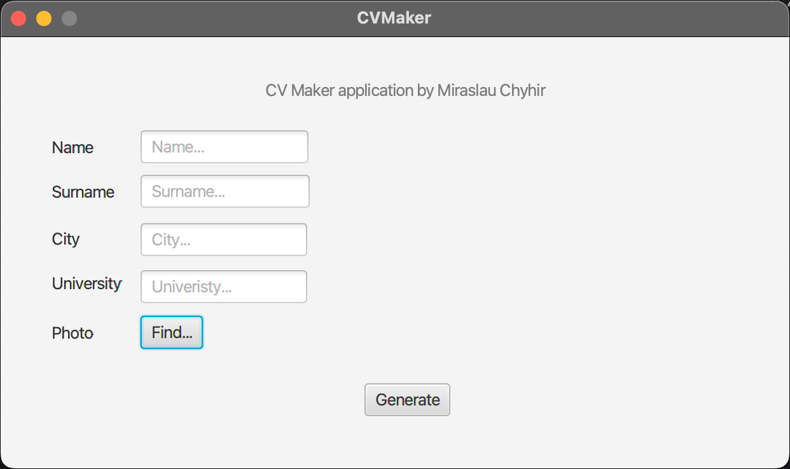
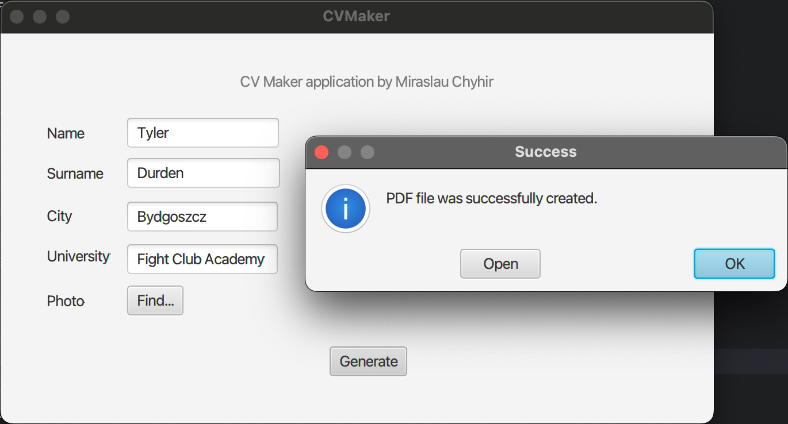
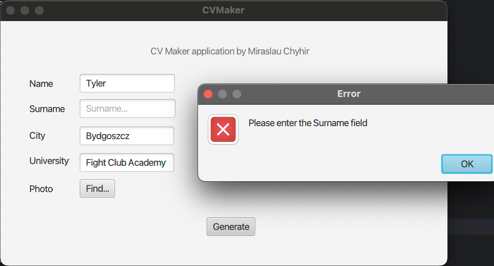
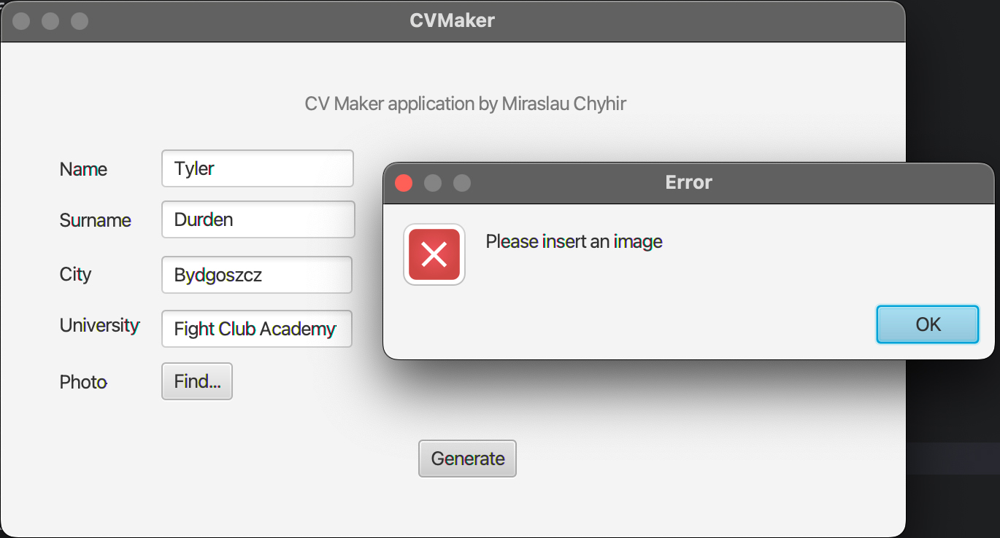
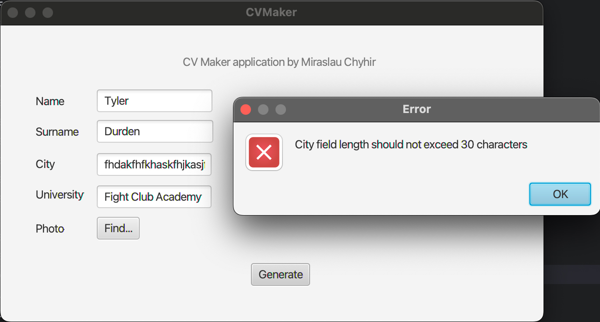
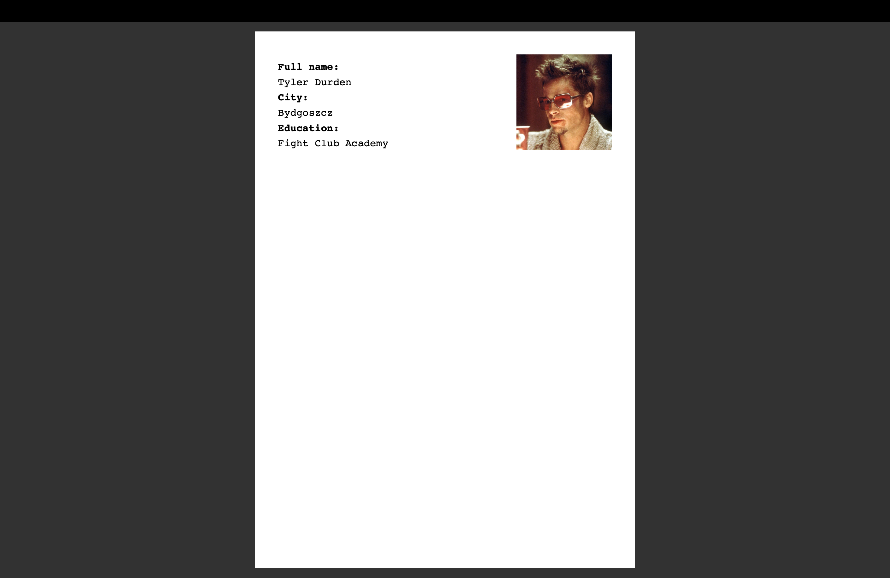

# JavaSVMaker-Project

## Overview
CV Maker is a Java application designed to assist users in creating their curriculum vitae (CV) with ease. The application utilizes JavaFX for the graphical user interface, providing a user-friendly experience for crafting resumes.

## Getting Started
To run the application, follow these steps:

1. Clone the repository to your local machine:
   ```bash
   git clone https://github.com/miraslauli/JavaSVMaker-Project.git
   ```
2. Open the project in your preferred Java IDE.

3. Run the `HelloApplication.java` file to launch the CV Maker application.

## Features
- **User-Friendly Interface**: The application features an intuitive interface for creating and editing CV details.

- **CV Fields**: Users can input information such as name, surname, city, university, and more.

- **Photo Integration**: The application allows users to find and attach a photo to their CV.

- **Generate CV**: By clicking the "Generate" button, users can generate their CV with the provided information.

## Screenshots

### Start and end menu
|                                                                                                                                                                 |                                                                                                                                                                                  |
|-----------------------------------------------------------------------------------------------------------------------------------------------------------------|----------------------------------------------------------------------------------------------------------------------------------------------------------------------------------| 
| <figure style="flex-basis: 45%;">  <figcaption>Program start interface</figcaption> </figure> | <figure style="flex-basis: 45%;">  <figcaption>Message about successful PDF creation.</figcaption> </figure> | 

### Error messages
|                                                                                                                                                                         |                                                                                                                                                                            |
|-------------------------------------------------------------------------------------------------------------------------------------------------------------------------|----------------------------------------------------------------------------------------------------------------------------------------------------------------------------|
| <figure style="flex-basis: 45%;">  <figcaption>Empty field error.</figcaption> </figure>              | <figure style="flex-basis: 45%;">  <figcaption>No image error.</figcaption> </figure>               |
| <figure style="flex-basis: 45%;">  <figcaption>Too many characters error.</figcaption> </figure> | <figure style="flex-basis: 45%;">  <figcaption>Digits in the wrong fields error.</figcaption> </figure> |

### Image of the final document



Screenshot from a Macbook.

## File Structure
- `HelloApplication.java`: The main Java class responsible for launching the JavaFX application and setting up the initial stage.

- `hello-view.fxml`: The FXML file defining the structure and layout of the user interface.

- `HelloController.java`: The controller class associated with the FXML file, handling user interactions and events.

## Usage
1. Launch the application.
2. Fill in the required information in the provided text fields.
3. Optionally, click the "Find" button to attach a photo.
4. Click the "Generate" button to create your CV.

## License
This project is licensed under the [MIT License](LICENSE).

## Acknowledgments
Special thanks to Mr. Dr. Tomasz Zawadski for forbidding me from doing this project in Python and giving me the opportunity to get to know Java.

Happy CV crafting!
